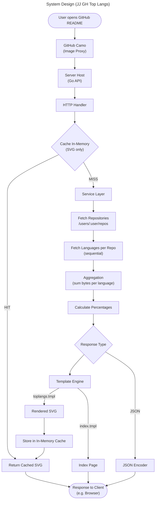

```mermaid
---
title: System Design (JJ GH Top Langs)
---

flowchart TD
  A(["User opens GitHub README"]) --> B["GitHub Camo\n(Image Proxy)"]

  B --> C["Server Host\n(Go API)"]

  C --> D["HTTP Handler"]

  D --> E{"Cache In-Memory\n(SVG only)"}

  E -- HIT --> F["Return Cached SVG"]

  E -- MISS --> G["Service Layer"]

  G --> H["Fetch Repositories\n/users/:user/repos"]

  H --> I["Fetch Languages per Repo\n(sequential)"]

  I --> J["Aggregation\n(sum bytes per language)"]

  J --> K["Calculate Percentages"]

  K --> L{"Response Type"}

  L --> M["Template Engine"]

  M --> |index.tmpl| N["Index Page"]

  L -->|JSON| O["JSON Encoder"]

  M --> |toplangs.tmpl| P["Rendered SVG"]

  P --> Q["Store in In-Memory Cache"]

  Q --> F

  F --> R(["Response to Client\n(e.g. Browser)"])

  N --> R
  O --> R
```
